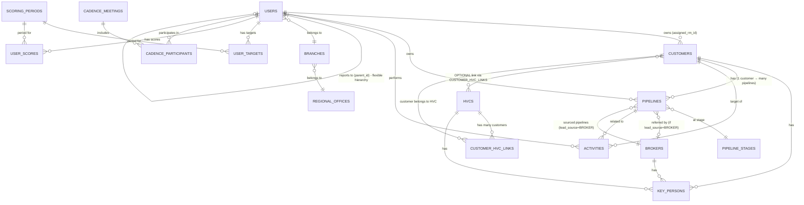

# 🗄️ Database Schema Overview

## LeadX CRM Database Structure

---

## 📋 Overview

Database LeadX CRM menggunakan **PostgreSQL** dengan ekstensi **PostGIS** untuk geolocation support, di-host pada **Supabase**. Schema dirancang untuk mendukung:

- Hierarchical user access (RBAC via closure table)
- Offline-first sync dengan conflict resolution
- 4DX scoring system
- Audit trail lengkap

---

## 📊 Entity Relationship Diagram (High-Level)



### Penjelasan Relasi Utama

| Relasi | Tipe | Keterangan |
|--------|------|------------|
| **HVC → Customer** | Many-to-Many (Optional) | 1 HVC bisa punya banyak Customer. Customer bisa juga **tidak** terhubung ke HVC manapun. |
| **Customer → Pipeline** | One-to-Many | 1 Customer bisa punya banyak Pipeline. |
| **Broker → Pipeline** | One-to-Many | Broker adalah **sumber lead** (lead_source = BROKER). Pipeline yang berasal dari Broker akan memiliki `broker_id`. |
| **User Hierarchy** | Flexible Parent | BM bisa langsung ke RM (tanpa BH) untuk cabang kecil. |

---

## 📁 Table Categories

### Overview by Category

| Category | Tables | Description |
|----------|--------|-------------|
| **Organization** | 4 tables | User hierarchy, branches, regions |
| **Geography** | 2 tables | Provinces, cities |
| **Master Data** | 10 tables | Reference/lookup data |
| **Business Data** | 6 tables | Core operational data |
| **HVC & Broker** | 4 tables | Partner management |
| **4DX Scoring** | 5 tables | Scoring system |
| **Cadence** | 3 tables | Meeting management |
| **Notifications** | 3 tables | Notification system |
| **System** | 2 tables | Audit, sync |

---

## 🏢 Organization Tables

### regional_offices
Kantor Wilayah (Regional Offices)

| Column | Type | Constraint | Description |
|--------|------|------------|-------------|
| `id` | UUID | PK, DEFAULT uuid_generate_v4() | Unique identifier |
| `code` | VARCHAR(20) | UNIQUE, NOT NULL | Regional code (e.g., "REG-JKT") |
| `name` | VARCHAR(100) | NOT NULL | Regional name |
| `description` | TEXT | | Description |
| `address` | TEXT | | Address |
| `latitude` | DECIMAL(10,8) | | GPS latitude |
| `longitude` | DECIMAL(11,8) | | GPS longitude |
| `phone` | VARCHAR(20) | | Phone number |
| `is_active` | BOOLEAN | DEFAULT TRUE | Soft delete flag |
| `created_at` | TIMESTAMPTZ | DEFAULT NOW() | Creation timestamp |
| `updated_at` | TIMESTAMPTZ | DEFAULT NOW() | Last update |

### branches
Kantor Cabang (Branch Offices)

| Column | Type | Constraint | Description |
|--------|------|------------|-------------|
| `id` | UUID | PK | Unique identifier |
| `code` | VARCHAR(20) | UNIQUE, NOT NULL | Branch code |
| `name` | VARCHAR(100) | NOT NULL | Branch name |
| `regional_office_id` | UUID | FK → regional_offices(id), NOT NULL | Parent regional |
| `address` | TEXT | | Address |
| `latitude` | DECIMAL(10,8) | | GPS latitude |
| `longitude` | DECIMAL(11,8) | | GPS longitude |
| `phone` | VARCHAR(20) | | Phone number |
| `is_active` | BOOLEAN | DEFAULT TRUE | Soft delete flag |
| `created_at` | TIMESTAMPTZ | DEFAULT NOW() | Creation timestamp |
| `updated_at` | TIMESTAMPTZ | DEFAULT NOW() | Last update |

### users
User accounts (extends Supabase auth.users)

| Column | Type | Constraint | Description |
|--------|------|------------|-------------|
| `id` | UUID | PK, FK → auth.users(id) | Supabase auth user ID |
| `email` | VARCHAR(255) | UNIQUE, NOT NULL | Email address |
| `name` | VARCHAR(100) | NOT NULL | Full name |
| `nip` | VARCHAR(50) | | Employee ID |
| `phone` | VARCHAR(20) | | Phone number |
| `role` | VARCHAR(20) | NOT NULL | SUPERADMIN/ADMIN/ROH/BM/BH/RM |
| `parent_id` | UUID | FK → users(id) | Direct supervisor |
| `branch_id` | UUID | FK → branches(id) | Assigned branch |
| `regional_office_id` | UUID | FK → regional_offices(id) | Assigned regional |
| `photo_url` | TEXT | | Profile photo URL |
| `is_active` | BOOLEAN | DEFAULT TRUE | Account status |
| `last_login_at` | TIMESTAMPTZ | | Last login timestamp |
| `created_at` | TIMESTAMPTZ | DEFAULT NOW() | Creation timestamp |
| `updated_at` | TIMESTAMPTZ | DEFAULT NOW() | Last update |

### user_hierarchy
Closure table untuk hierarchical RBAC

| Column | Type | Constraint | Description |
|--------|------|------------|-------------|
| `ancestor_id` | UUID | PK, FK → users(id) | Ancestor user |
| `descendant_id` | UUID | PK, FK → users(id) | Descendant user |
| `depth` | INTEGER | NOT NULL | 0=self, 1=direct child, 2=grandchild, ... |

**Usage:** Efficient query untuk "semua subordinates" tanpa recursive query.

---

## 📍 Geography Tables

### provinces

| Column | Type | Constraint | Description |
|--------|------|------------|-------------|
| `id` | UUID | PK | Unique identifier |
| `code` | VARCHAR(10) | UNIQUE, NOT NULL | Province code |
| `name` | VARCHAR(100) | NOT NULL | Province name |
| `is_active` | BOOLEAN | DEFAULT TRUE | Active flag |

### cities

| Column | Type | Constraint | Description |
|--------|------|------------|-------------|
| `id` | UUID | PK | Unique identifier |
| `code` | VARCHAR(10) | UNIQUE, NOT NULL | City code |
| `name` | VARCHAR(100) | NOT NULL | City name |
| `province_id` | UUID | FK → provinces(id), NOT NULL | Parent province |
| `is_active` | BOOLEAN | DEFAULT TRUE | Active flag |

---

## 📋 Master Data Tables

### company_types
Bentuk usaha: PT, CV, UD, Perorangan, dll.

### ownership_types
Kepemilikan: BUMN, Swasta, BUMD, Asing, dll.

### industries
Sektor industri customer

### cob (Class of Business)
Kelas bisnis asuransi (e.g., Surety Bond, General Insurance)

### lob (Line of Business)
Sub-kategori di dalam COB

### pipeline_stages
Stage pipeline dengan probability (Configurable in Admin Panel)

| Column | Type | Constraint | Description |
|--------|------|------------|-------------|
| `id` | UUID | PK | Unique identifier |
| `code` | VARCHAR(20) | UNIQUE, NOT NULL | Stage code |
| `name` | VARCHAR(100) | NOT NULL | Stage name |
| `probability` | INTEGER | NOT NULL | Win probability (0-100) |
| `sequence` | INTEGER | NOT NULL | Display order |
| `color` | VARCHAR(20) | | UI color (hex) |
| `is_final` | BOOLEAN | DEFAULT FALSE | Final stage flag |
| `is_won` | BOOLEAN | DEFAULT FALSE | Won stage flag |
| `is_active` | BOOLEAN | DEFAULT TRUE | Active flag |
| `created_at` | TIMESTAMPTZ | DEFAULT NOW() | Creation time |
| `updated_at` | TIMESTAMPTZ | DEFAULT NOW() | Last update |

**Default Stages:**
| Code | Name | Probability | is_final | is_won |
|------|------|-------------|----------|--------|
| NEW | New Lead | 10% | false | false |
| P3 | Cold | 25% | false | false |
| P2 | Warm | 50% | false | false |
| P1 | Hot | 75% | false | false |
| ACCEPTED | Won | 100% | true | true |
| DECLINED | Lost | 0% | true | false |

### pipeline_statuses
Status per stage - setiap stage HARUS memiliki minimal 1 status

| Column | Type | Constraint | Description |
|--------|------|------------|-------------|
| `id` | UUID | PK | Unique identifier |
| `stage_id` | UUID | FK, NOT NULL | Parent stage |
| `code` | VARCHAR(50) | NOT NULL | Status code |
| `name` | VARCHAR(100) | NOT NULL | Status name |
| `description` | TEXT | | Description |
| `sequence` | INTEGER | NOT NULL | Display order within stage |
| `is_default` | BOOLEAN | DEFAULT FALSE | Default status for stage |
| `is_active` | BOOLEAN | DEFAULT TRUE | Active flag |
| `created_at` | TIMESTAMPTZ | DEFAULT NOW() | Creation time |
| `updated_at` | TIMESTAMPTZ | DEFAULT NOW() | Last update |

**Example Status per Stage (Admin Configurable):**
| Stage | Status Options |
|-------|---------------|
| NEW | Initial Contact, Qualified, Not Qualified |
| P3 | Needs Analysis, Information Gathering |
| P2 | Proposal Sent, Proposal Reviewed, Negotiation |
| P1 | Final Negotiation, Awaiting Decision, Contract Review |
| ACCEPTED | Policy Issued, Premium Paid |
| DECLINED | Price Issue, Competitor Won, No Budget, Not Interested |

### lead_sources
Sumber lead (termasuk REFERRAL untuk referral antar RM)

| Column | Type | Constraint | Description |
|--------|------|------------|-------------|
| `id` | UUID | PK | Unique identifier |
| `code` | VARCHAR(20) | UNIQUE, NOT NULL | Source code |
| `name` | VARCHAR(100) | NOT NULL | Source name |
| `requires_referrer` | BOOLEAN | DEFAULT FALSE | Needs referrer info |
| `requires_broker` | BOOLEAN | DEFAULT FALSE | Needs broker info |
| `is_active` | BOOLEAN | DEFAULT TRUE | Active flag |

**Default Sources:**
| Code | Name | requires_referrer | requires_broker |
|------|------|-------------------|-----------------|
| DIRECT | Direct Prospecting | false | false |
| BROKER | From Broker/Agent | false | **true** |
| REFERRAL | Referral from Other RM | **true** | false |
| EVENT | Event/Exhibition | false | false |
| INBOUND | Inbound Inquiry | false | false |

### decline_reasons
Alasan decline pipeline

### activity_types
Jenis aktivitas dengan konfigurasi

| Code | require_location | require_photo | require_notes |
|------|------------------|---------------|---------------|
| VISIT | true | false | true |
| CALL | false | false | true |
| MEETING | true | false | true |
| PROPOSAL | false | false | false |
| FOLLOW_UP | false | false | true |
| EMAIL | false | false | false |
| WHATSAPP | false | false | false |

---

## 💼 Business Data Tables

### customers
Data customer utama

| Column | Type | Constraint | Description |
|--------|------|------------|-------------|
| `id` | UUID | PK | Unique identifier |
| `code` | VARCHAR(20) | UNIQUE, NOT NULL | Customer code (auto-generate) |
| `name` | VARCHAR(200) | NOT NULL | Company name |
| `address` | TEXT | NOT NULL | Address |
| `province_id` | UUID | FK, NOT NULL | Province |
| `city_id` | UUID | FK, NOT NULL | City |
| `postal_code` | VARCHAR(10) | | Postal code |
| `latitude` | DECIMAL(10,8) | | GPS latitude |
| `longitude` | DECIMAL(11,8) | | GPS longitude |
| `location` | GEOMETRY(Point, 4326) | | PostGIS point (auto-computed) |
| `phone` | VARCHAR(20) | | Phone |
| `email` | VARCHAR(255) | | Email |
| `website` | VARCHAR(255) | | Website |
| `company_type_id` | UUID | FK, NOT NULL | Company type (PT/CV/etc) |
| `ownership_type_id` | UUID | FK, NOT NULL | Ownership type |
| `industry_id` | UUID | FK, NOT NULL | Industry |
| `npwp` | VARCHAR(30) | | Tax ID |
| `assigned_rm_id` | UUID | FK, NOT NULL | Assigned RM |
| `image_url` | TEXT | | Customer logo/image URL (optional) |
| `notes` | TEXT | | Additional notes |
| `is_active` | BOOLEAN | DEFAULT TRUE | Active flag |
| `created_by` | UUID | FK, NOT NULL | Creator |
| `created_at` | TIMESTAMPTZ | DEFAULT NOW() | Creation time |
| `updated_at` | TIMESTAMPTZ | DEFAULT NOW() | Last update |
| `deleted_at` | TIMESTAMPTZ | | Soft delete timestamp |

### key_persons
Unified key persons untuk Customer, Broker, HVC

| Column | Type | Constraint | Description |
|--------|------|------------|-------------|
| `id` | UUID | PK | Unique identifier |
| `owner_type` | VARCHAR(20) | NOT NULL | 'CUSTOMER'/'BROKER'/'HVC' |
| `customer_id` | UUID | FK → customers(id) | If owner_type = CUSTOMER |
| `broker_id` | UUID | FK → brokers(id) | If owner_type = BROKER |
| `hvc_id` | UUID | FK → hvcs(id) | If owner_type = HVC |
| `name` | VARCHAR(100) | NOT NULL | Contact name |
| `position` | VARCHAR(100) | | Job title |
| `department` | VARCHAR(100) | | Department |
| `phone` | VARCHAR(20) | | Phone |
| `email` | VARCHAR(255) | | Email |
| `is_primary` | BOOLEAN | DEFAULT FALSE | Primary contact flag |
| `is_active` | BOOLEAN | DEFAULT TRUE | Active flag |
| `notes` | TEXT | | Notes |
| `created_by` | UUID | FK, NOT NULL | Creator |
| `created_at` | TIMESTAMPTZ | DEFAULT NOW() | Creation time |
| `updated_at` | TIMESTAMPTZ | DEFAULT NOW() | Last update |
| `deleted_at` | TIMESTAMPTZ | | Soft delete timestamp |

### pipelines
Data pipeline penjualan

| Column | Type | Constraint | Description |
|--------|------|------------|-------------|
| `id` | UUID | PK | Unique identifier |
| `code` | VARCHAR(20) | UNIQUE, NOT NULL | Pipeline code |
| `customer_id` | UUID | FK, NOT NULL | Customer |
| `stage_id` | UUID | FK, NOT NULL | Current stage |
| `status_id` | UUID | FK, NOT NULL | Current status |
| `cob_id` | UUID | FK, NOT NULL | Class of Business |
| `lob_id` | UUID | FK, NOT NULL | Line of Business |
| `lead_source_id` | UUID | FK, NOT NULL | Lead source |
| `broker_id` | UUID | FK | Broker (if source=BROKER) |
| `broker_pic_id` | UUID | FK → key_persons | Broker PIC |
| `customer_contact_id` | UUID | FK → key_persons | Customer contact |
| `tsi` | DECIMAL(18,2) | | TSI (Total Sum Insured) |
| `potential_premium` | DECIMAL(18,2) | NOT NULL | Potential premium |
| `final_premium` | DECIMAL(18,2) | | Final premium (when won) |
| `weighted_value` | DECIMAL(18,2) | | potential × probability |
| `expected_close_date` | DATE | | Expected close date |
| `policy_number` | VARCHAR(50) | | Policy number (when won) |
| `decline_reason` | TEXT | | Decline reason (when lost) |
| `notes` | TEXT | | Notes |
| `is_tender` | BOOLEAN | DEFAULT FALSE | Tender flag |
| `referred_by_user_id` | UUID | FK → users | Referrer (for scoring) |
| `referral_id` | UUID | FK → pipeline_referrals | Referral record (if from referral) |
| `assigned_rm_id` | UUID | FK, NOT NULL | Assigned RM |
| `created_by` | UUID | FK, NOT NULL | Creator |
| `created_at` | TIMESTAMPTZ | DEFAULT NOW() | Creation time |
| `updated_at` | TIMESTAMPTZ | DEFAULT NOW() | Last update |
| `closed_at` | TIMESTAMPTZ | | Closing time |
| `deleted_at` | TIMESTAMPTZ | | Soft delete timestamp |

### pipeline_referrals
**Mekanisme referral pipeline antar RM dengan handshake dan approval BM**

| Column | Type | Constraint | Description |
|--------|------|------------|-------------|
| `id` | UUID | PK | Unique identifier |
| `code` | VARCHAR(20) | UNIQUE, NOT NULL | Referral code (REF-YYYYMMDD-XXX) |
| `customer_id` | UUID | FK, NOT NULL | Customer yang di-refer |
| `cob_id` | UUID | FK, NOT NULL | Class of Business |
| `lob_id` | UUID | FK, NOT NULL | Line of Business |
| `potential_premium` | DECIMAL(18,2) | NOT NULL | Estimated premium |
| `referrer_rm_id` | UUID | FK, NOT NULL | RM yang memberikan referral |
| `receiver_rm_id` | UUID | FK, NOT NULL | RM yang menerima referral |
| `referrer_branch_id` | UUID | FK, NOT NULL | Branch referrer |
| `receiver_branch_id` | UUID | FK, NOT NULL | Branch receiver |
| `reason` | TEXT | NOT NULL | Alasan referral |
| `notes` | TEXT | | Catatan tambahan |
| `status` | VARCHAR(30) | NOT NULL | See status flow below |
| `receiver_accepted_at` | TIMESTAMPTZ | | Timestamp receiver accept |
| `receiver_rejected_at` | TIMESTAMPTZ | | Timestamp receiver reject |
| `receiver_reject_reason` | TEXT | | Alasan ditolak receiver |
| `bm_approved_at` | TIMESTAMPTZ | | Timestamp BM approval |
| `bm_approved_by` | UUID | FK → users | BM yang approve |
| `bm_rejected_at` | TIMESTAMPTZ | | Timestamp BM reject |
| `bm_reject_reason` | TEXT | | Alasan BM reject |
| `pipeline_id` | UUID | FK → pipelines | Pipeline yang dibuat setelah approved |
| `created_at` | TIMESTAMPTZ | DEFAULT NOW() | Creation time |
| `updated_at` | TIMESTAMPTZ | DEFAULT NOW() | Last update |

**Referral Status Flow:**
```
PENDING_RECEIVER → RECEIVER_ACCEPTED → PENDING_BM_APPROVAL → APPROVED → PIPELINE_CREATED
                 ↘ RECEIVER_REJECTED
                                     ↘ BM_REJECTED
```

| Status | Description | Next Steps |
|--------|-------------|------------|
| PENDING_RECEIVER | Menunggu receiver RM accept/reject | Receiver menerima/menolak |
| RECEIVER_ACCEPTED | Receiver sudah accept, menunggu BM | BM approve/reject |
| RECEIVER_REJECTED | Receiver menolak referral | End state |
| PENDING_BM_APPROVAL | Menunggu approval BM receiver | BM approve/reject |
| BM_REJECTED | BM menolak referral | End state |
| APPROVED | Semua pihak setuju | Create pipeline |
| PIPELINE_CREATED | Pipeline sudah dibuat | End state |

**Scoring Impact:**
- Referrer RM mendapat **REFERRAL_BONUS** ketika pipeline dari referral ACCEPTED
- Bonus dihitung berdasarkan % dari final_premium (configurable di Admin)

### activities
Unified activities (scheduled + immediate)

| Column | Type | Constraint | Description |
|--------|------|------------|-------------|
| `id` | UUID | PK | Unique identifier |
| `user_id` | UUID | FK, NOT NULL | Activity owner |
| `created_by` | UUID | FK, NOT NULL | Creator |
| `object_type` | VARCHAR(20) | NOT NULL | 'CUSTOMER'/'HVC'/'BROKER'/'PIPELINE' |
| `customer_id` | UUID | FK | If object_type = CUSTOMER |
| `hvc_id` | UUID | FK | If object_type = HVC |
| `broker_id` | UUID | FK | If object_type = BROKER |
| `pipeline_id` | UUID | FK | If object_type = PIPELINE |
| `activity_type_id` | UUID | FK, NOT NULL | Activity type |
| `summary` | VARCHAR(255) | | Summary |
| `notes` | TEXT | | Notes |
| `scheduled_datetime` | TIMESTAMPTZ | NOT NULL | Scheduled time |
| `is_immediate` | BOOLEAN | DEFAULT FALSE | Immediate activity flag |
| `status` | VARCHAR(20) | NOT NULL, DEFAULT 'PLANNED' | PLANNED/IN_PROGRESS/COMPLETED/CANCELLED/RESCHEDULED/OVERDUE |
| `executed_at` | TIMESTAMPTZ | | Execution time |
| `latitude` | DECIMAL(10,8) | | GPS latitude at execution |
| `longitude` | DECIMAL(11,8) | | GPS longitude at execution |
| `location` | GEOMETRY(Point, 4326) | | PostGIS point |
| `location_accuracy` | DECIMAL(8,2) | | GPS accuracy (meters) |
| `distance_from_target` | DECIMAL(10,2) | | Distance from customer |
| `is_location_override` | BOOLEAN | DEFAULT FALSE | Location override flag |
| `override_reason` | TEXT | | Override reason |
| `rescheduled_from_id` | UUID | FK → activities | Original activity |
| `rescheduled_to_id` | UUID | FK → activities | New activity |
| `cancelled_at` | TIMESTAMPTZ | | Cancellation time |
| `cancel_reason` | TEXT | | Cancellation reason |
| `created_at` | TIMESTAMPTZ | DEFAULT NOW() | Creation time |
| `updated_at` | TIMESTAMPTZ | DEFAULT NOW() | Last update |
| `synced_at` | TIMESTAMPTZ | | Last sync time |
| `deleted_at` | TIMESTAMPTZ | | Soft delete timestamp |

### activity_photos

| Column | Type | Constraint | Description |
|--------|------|------------|-------------|
| `id` | UUID | PK | Unique identifier |
| `activity_id` | UUID | FK, NOT NULL | Parent activity |
| `photo_url` | TEXT | NOT NULL | Photo URL (Supabase Storage) |
| `caption` | TEXT | | Photo caption |
| `taken_at` | TIMESTAMPTZ | | Photo timestamp |
| `latitude` | DECIMAL(10,8) | | Photo GPS latitude |
| `longitude` | DECIMAL(11,8) | | Photo GPS longitude |
| `created_at` | TIMESTAMPTZ | DEFAULT NOW() | Upload time |

> **Note (Offline-First):** The local Drift database includes additional fields for offline functionality:
> - `local_path` TEXT - Local file path on device (not synced to Supabase)
> - `is_pending_upload` BOOLEAN - Sync status flag (not synced to Supabase)

### activity_audit_logs
**History log untuk setiap perubahan pada Activity**

| Column | Type | Constraint | Description |
|--------|------|------------|-------------|
| `id` | UUID | PK | Unique identifier |
| `activity_id` | UUID | FK, NOT NULL | Target activity |
| `action` | VARCHAR(50) | NOT NULL | See action types below |
| `old_status` | VARCHAR(20) | | Previous status |
| `new_status` | VARCHAR(20) | | New status |
| `old_values` | JSONB | | Previous field values |
| `new_values` | JSONB | | New field values |
| `changed_fields` | TEXT[] | | List of changed fields |
| `latitude` | DECIMAL(10,8) | | GPS at time of change |
| `longitude` | DECIMAL(11,8) | | GPS at time of change |
| `device_info` | JSONB | | Device info (OS, app version) |
| `performed_by` | UUID | FK, NOT NULL | User who made change |
| `performed_at` | TIMESTAMPTZ | DEFAULT NOW() | Change timestamp |
| `notes` | TEXT | | Additional notes |

**Action Types:**
| Action | Description |
|--------|-------------|
| `CREATED` | Activity created |
| `STATUS_CHANGED` | Status updated (PLANNED→IN_PROGRESS, etc) |
| `EXECUTED` | Activity marked completed with GPS |
| `RESCHEDULED` | Activity rescheduled |
| `CANCELLED` | Activity cancelled |
| `EDITED` | Fields edited |
| `PHOTO_ADDED` | Photo attached |
| `PHOTO_REMOVED` | Photo removed |
| `GPS_OVERRIDE` | GPS location overridden |
| `SYNCED` | Synced from offline |

**Example Trigger:**
```sql
CREATE OR REPLACE FUNCTION log_activity_changes()
RETURNS TRIGGER AS $$
BEGIN
  INSERT INTO activity_audit_logs (
    activity_id, action, old_status, new_status,
    old_values, new_values, performed_by, performed_at
  ) VALUES (
    NEW.id,
    CASE 
      WHEN TG_OP = 'INSERT' THEN 'CREATED'
      WHEN OLD.status != NEW.status THEN 'STATUS_CHANGED'
      ELSE 'EDITED'
    END,
    OLD.status,
    NEW.status,
    to_jsonb(OLD),
    to_jsonb(NEW),
    COALESCE(NEW.updated_by, auth.uid()),
    NOW()
  );
  RETURN NEW;
END;
$$ LANGUAGE plpgsql;

CREATE TRIGGER activity_audit_trigger
AFTER INSERT OR UPDATE ON activities
FOR EACH ROW EXECUTE FUNCTION log_activity_changes();
```

---

## 🏢 HVC & Broker Tables

### hvc_types
Tipe HVC: Industrial Estate, Bank, BUMN Group, dll.

### hvcs
High Value Customer data

| Column | Type | Constraint | Description |
|--------|------|------------|-------------|
| `id` | UUID | PK | Unique identifier |
| `code` | VARCHAR(20) | UNIQUE, NOT NULL | HVC code |
| `name` | VARCHAR(200) | NOT NULL | HVC name |
| `type_id` | UUID | FK, NOT NULL | HVC type |
| `description` | TEXT | | Description |
| `address` | TEXT | | Address |
| `latitude` | DECIMAL(10,8) | | GPS latitude |
| `longitude` | DECIMAL(11,8) | | GPS longitude |
| `location` | GEOMETRY(Point, 4326) | | PostGIS point |
| `radius_meters` | INTEGER | DEFAULT 500 | Geofence radius |
| `potential_value` | DECIMAL(18,2) | | Potential business value |
| `image_url` | TEXT | | HVC logo/image URL (optional) |
| `is_active` | BOOLEAN | DEFAULT TRUE | Active flag |
| `created_by` | UUID | FK, NOT NULL | Creator |
| `created_at` | TIMESTAMPTZ | DEFAULT NOW() | Creation time |
| `updated_at` | TIMESTAMPTZ | DEFAULT NOW() | Last update |
| `deleted_at` | TIMESTAMPTZ | | Soft delete timestamp |

### customer_hvc_links
Many-to-many link antara Customer dan HVC

| Column | Type | Constraint | Description |
|--------|------|------------|-------------|
| `id` | UUID | PK | Unique identifier |
| `customer_id` | UUID | FK, NOT NULL | Customer |
| `hvc_id` | UUID | FK, NOT NULL | HVC |
| `relationship_type` | VARCHAR(50) | NOT NULL | HOLDING/SUBSIDIARY/AFFILIATE/JV/TENANT/MEMBER/SUPPLIER/CONTRACTOR/DISTRIBUTOR |
| `is_active` | BOOLEAN | DEFAULT TRUE | Active flag |
| `created_by` | UUID | FK, NOT NULL | Creator |
| `created_at` | TIMESTAMPTZ | DEFAULT NOW() | Creation time |
| `updated_at` | TIMESTAMPTZ | DEFAULT NOW() | Last update |
| `deleted_at` | TIMESTAMPTZ | | Soft delete timestamp |

### brokers
Data broker/agent

| Column | Type | Constraint | Description |
|--------|------|------------|-------------|
| `id` | UUID | PK | Unique identifier |
| `code` | VARCHAR(20) | UNIQUE, NOT NULL | Broker code |
| `name` | VARCHAR(200) | NOT NULL | Broker name |
| `type` | VARCHAR(20) | NOT NULL | 'BROKER'/'AGENT' |
| `address` | TEXT | | Address |
| `phone` | VARCHAR(20) | | Phone |
| `email` | VARCHAR(255) | | Email |
| `bank_name` | VARCHAR(100) | | Bank name |
| `bank_account_number` | VARCHAR(50) | | Bank account |
| `bank_account_name` | VARCHAR(100) | | Account holder name |
| `image_url` | TEXT | | Broker logo/image URL (optional) |
| `is_active` | BOOLEAN | DEFAULT TRUE | Active flag |
| `created_by` | UUID | FK, NOT NULL | Creator |
| `created_at` | TIMESTAMPTZ | DEFAULT NOW() | Creation time |
| `updated_at` | TIMESTAMPTZ | DEFAULT NOW() | Last update |
| `deleted_at` | TIMESTAMPTZ | | Soft delete timestamp |

---

## 📊 4DX Scoring Tables

### measure_definitions
Definisi measures (lead & lag)

### scoring_periods
Periode scoring (weekly, monthly, quarterly)

### user_targets
Target per user per periode per measure

### user_scores
Actual score per user per periode per measure

### period_summary_scores
Summary score dengan ranking

---

## 📅 Cadence Tables

### cadence_schedule_config
Konfigurasi jadwal cadence per level

### cadence_meetings
Instance meeting cadence

### cadence_participants
Participant data dengan pre-meeting form

---

## 📝 Audit Table

### audit_log

| Column | Type | Constraint | Description |
|--------|------|------------|-------------|
| `id` | UUID | PK | Unique identifier |
| `table_name` | VARCHAR(100) | NOT NULL | Target table |
| `record_id` | UUID | NOT NULL | Target record ID |
| `action` | VARCHAR(20) | NOT NULL | CREATE/UPDATE/DELETE |
| `old_values` | JSONB | | Previous values |
| `new_values` | JSONB | | New values |
| `changed_by` | UUID | FK → users | User who made change |
| `changed_at` | TIMESTAMPTZ | DEFAULT NOW() | Change timestamp |
| `ip_address` | INET | | Client IP (optional) |

---

## 🔒 Row Level Security (RLS) Patterns

### Pattern 1: Owner-based Access
```sql
-- Users can only see their own customers
CREATE POLICY "Users see own customers" ON customers
FOR SELECT USING (assigned_rm_id = auth.uid());
```

### Pattern 2: Hierarchical Access
```sql
-- Users can see customers of subordinates
CREATE POLICY "Users see subordinate customers" ON customers
FOR SELECT USING (
  EXISTS (
    SELECT 1 FROM user_hierarchy
    WHERE ancestor_id = auth.uid()
    AND descendant_id = customers.assigned_rm_id
  )
);
```

### Pattern 3: Admin Access
```sql
-- Admins see all
CREATE POLICY "Admins see all" ON customers
FOR ALL USING (
  EXISTS (
    SELECT 1 FROM users
    WHERE id = auth.uid()
    AND role IN ('ADMIN', 'SUPERADMIN')
  )
);
```

---

## 📚 Related Documents

- [Entity Relationship](entity-relationship.md) - Full ER diagram
- [RLS Policies](rls-policies.md) - Complete RLS definitions
- [Tables Detail](tables/) - Per-table documentation

---

*Database schema version 2.0 - January 2025*
