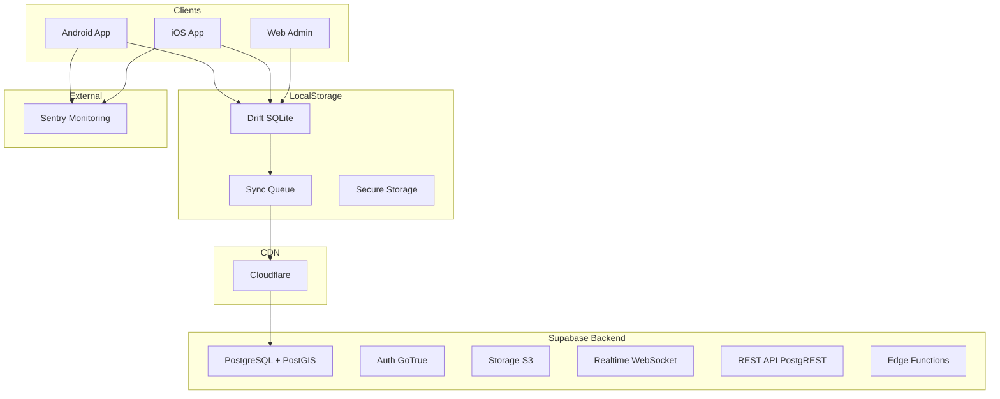

# LeadX CRM - Product Requirements Document (PRD)
## Part 2: Architecture & Technical Stack

---

## Informasi Dokumen

| Field | Nilai |
|-------|-------|
| Nama Produk | LeadX CRM - PT Askrindo (Persero) |
| Bagian | 2 dari 3 - Arsitektur & Technical |
| Versi | 2.0 |

### Dokumen Terkait

| Dokumen | Link |
|---------|------|
| PRD Part 1 | [PRD_Part1_Overview_Requirements.md](./PRD_Part1_Overview_Requirements.md) |
| PRD Part 3 | [PRD_Part3_UI_Implementation_Planning.md](./PRD_Part3_UI_Implementation_Planning.md) |

---

## 7. Arsitektur Sistem

### 7.1 Jenis Aplikasi

**Mobile-first hybrid architecture:**
- Android & iOS native apps (Flutter)
- Web Admin (Flutter Web)
- Offline-first dengan local SQLite database

### 7.2 Diagram Sistem



### 7.3 Offline-First Architecture

```
┌─────────────────────────────────────────────────────────────────────────────┐
│                              LeadX App                                       │
├─────────────────────────────────────────────────────────────────────────────┤
│  ┌──────────────┐    ┌──────────────┐    ┌──────────────┐                   │
│  │   UI Layer   │───▶│  Repository  │───▶│  Local DB    │                   │
│  │  (Widgets)   │    │   Pattern    │    │  (Drift)     │                   │
│  └──────────────┘    └──────────────┘    └──────────────┘                   │
│                              │                   │                           │
│                              │                   ▼                           │
│                              │           ┌──────────────┐                   │
│                              │           │  Sync Queue  │                   │
│                              │           └──────────────┘                   │
│                              │                   │                           │
│                              ▼                   ▼                           │
│                       ┌─────────────────────────────────┐                   │
│                       │        Sync Service             │                   │
│                       │  (Background + Connectivity)    │                   │
│                       └─────────────────────────────────┘                   │
└──────────────────────────────────────│───────────────────────────────────────┘
                                       ▼
                              ┌─────────────────┐
                              │    Supabase     │
                              │   PostgreSQL    │
                              └─────────────────┘
```

---

## 8. Technical Stack

### 8.1 Frontend

| Component | Technology | Purpose |
|-----------|------------|---------|
| Framework | Flutter 3.x | Cross-platform UI |
| Language | Dart 3.x | Programming language |
| State Management | Riverpod 2.x | Reactive state |
| Navigation | go_router | Declarative routing |
| Local Database | Drift + drift_flutter | Offline storage (SQLite/WASM) |
| HTTP Client | Dio | API requests |
| Supabase Client | supabase_flutter | Backend integration |

### 8.2 Backend

| Component | Technology | Purpose |
|-----------|------------|---------|
| Database | PostgreSQL 15 | Primary data store |
| Extensions | PostGIS | Geolocation support |
| API | PostgREST | Auto-generated REST API |
| Auth | GoTrue | JWT Authentication |
| Realtime | Realtime Server | WebSocket subscriptions |
| Storage | Supabase Storage | File storage (S3) |
| Functions | Edge Functions (Deno) | Serverless compute |

### 8.3 Infrastructure

| Service | Provider | Cost/Month |
|---------|----------|------------|
| Hosting | Supabase Pro (Singapore) | $25 |
| CDN | Cloudflare (Free) | $0 |
| Web Hosting | Cloudflare Pages | $0 |
| Monitoring | Sentry Free | $0 |
| **Total** | | **~$25/month** |

---

## 9. Complete Database Schema

### 9.1 Schema Overview

| Kategori | Tabel | Deskripsi |
|----------|-------|-----------|
| **Organization** | regional_offices, branches, users, user_hierarchy | Struktur organisasi |
| **Geography** | provinces, cities | Data geografis |
| **Master Data** | company_types, ownership_types, industries, cob, lob, lead_sources, decline_reasons | Parameter bisnis |
| **Pipeline Config** | pipeline_stages, pipeline_statuses | Konfigurasi stage |
| **Business Data** | customers, key_persons, pipelines, activities, activity_types, activity_photos | Data operasional |
| **HVC & Broker** | hvc, hvc_types, customer_hvc_links, brokers | Partner management |
| **4DX Scoring** | measure_definitions, scoring_periods, user_targets, user_scores, period_summary_scores | Scoring system |
| **Cadence** | cadence_schedule_config, cadence_meetings, cadence_participants | Meeting management |
| **Notifications** | notification_templates, notification_preferences, notifications | Notification system |
| **Announcements** | announcements, announcement_attachments, announcement_reads | Announcement system |
| **Audit** | audit_log | Centralized history |

---

### 9.2 Organization Tables

#### regional_offices (Kantor Wilayah)
```sql
CREATE TABLE regional_offices (
    id UUID PRIMARY KEY DEFAULT uuid_generate_v4(),
    code VARCHAR(20) UNIQUE NOT NULL,
    name VARCHAR(100) NOT NULL,
    description TEXT,
    address TEXT,
    latitude DECIMAL(10, 8),
    longitude DECIMAL(11, 8),
    phone VARCHAR(20),
    is_active BOOLEAN DEFAULT TRUE,
    created_at TIMESTAMPTZ DEFAULT NOW(),
    updated_at TIMESTAMPTZ DEFAULT NOW()
);
```

#### branches (Kantor Cabang)
```sql
CREATE TABLE branches (
    id UUID PRIMARY KEY DEFAULT uuid_generate_v4(),
    code VARCHAR(20) UNIQUE NOT NULL,
    name VARCHAR(100) NOT NULL,
    regional_office_id UUID NOT NULL REFERENCES regional_offices(id),
    address TEXT,
    latitude DECIMAL(10, 8),
    longitude DECIMAL(11, 8),
    phone VARCHAR(20),
    is_active BOOLEAN DEFAULT TRUE,
    created_at TIMESTAMPTZ DEFAULT NOW(),
    updated_at TIMESTAMPTZ DEFAULT NOW()
);
```

#### users (extends Supabase auth.users)
```sql
CREATE TABLE users (
    id UUID PRIMARY KEY REFERENCES auth.users(id) ON DELETE CASCADE,
    email VARCHAR(255) UNIQUE NOT NULL,
    name VARCHAR(100) NOT NULL,
    nip VARCHAR(50),
    phone VARCHAR(20),
    role VARCHAR(20) NOT NULL CHECK (role IN ('SUPERADMIN', 'ADMIN', 'ROH', 'BM', 'BH', 'RM')),
    parent_id UUID REFERENCES users(id),
    branch_id UUID REFERENCES branches(id),
    regional_office_id UUID REFERENCES regional_offices(id),
    photo_url TEXT,
    is_active BOOLEAN DEFAULT TRUE,
    last_login_at TIMESTAMPTZ,
    created_at TIMESTAMPTZ DEFAULT NOW(),
    updated_at TIMESTAMPTZ DEFAULT NOW(),
    CONSTRAINT chk_no_self_parent CHECK (parent_id IS NULL OR parent_id != id)
);
```

#### user_hierarchy (Closure Table for RBAC)
```sql
CREATE TABLE user_hierarchy (
    ancestor_id UUID NOT NULL REFERENCES users(id) ON DELETE CASCADE,
    descendant_id UUID NOT NULL REFERENCES users(id) ON DELETE CASCADE,
    depth INTEGER NOT NULL,  -- 0=self, 1=direct child, 2=grandchild...
    PRIMARY KEY (ancestor_id, descendant_id)
);
```

---

### 9.3 Master Data Tables

#### company_types (Bentuk Usaha: PT, CV, UD, etc.)
```sql
CREATE TABLE company_types (
    id UUID PRIMARY KEY DEFAULT uuid_generate_v4(),
    code VARCHAR(20) UNIQUE NOT NULL,        -- 'PT', 'CV', 'UD', 'INDIVIDU'
    name VARCHAR(100) NOT NULL,               -- 'Perseroan Terbatas', etc.
    description TEXT,
    is_active BOOLEAN DEFAULT TRUE,
    sort_order INTEGER DEFAULT 0
);
```

#### ownership_types (Kepemilikan: BUMN, Swasta, etc.)
```sql
CREATE TABLE ownership_types (
    id UUID PRIMARY KEY DEFAULT uuid_generate_v4(),
    code VARCHAR(20) UNIQUE NOT NULL,        -- 'BUMN', 'NON_BUMN', 'BUMD', 'SWASTA', 'ASING'
    name VARCHAR(100) NOT NULL,
    description TEXT,
    priority_score INTEGER DEFAULT 0,         -- For lead scoring
    is_active BOOLEAN DEFAULT TRUE,
    sort_order INTEGER DEFAULT 0
);
```

#### industries (Sektor Industri)
```sql
CREATE TABLE industries (
    id UUID PRIMARY KEY DEFAULT uuid_generate_v4(),
    code VARCHAR(20) UNIQUE NOT NULL,
    name VARCHAR(100) NOT NULL,
    description TEXT,
    is_active BOOLEAN DEFAULT TRUE,
    sort_order INTEGER DEFAULT 0
);
```

#### cob (Class of Business)
```sql
CREATE TABLE cob (
    id UUID PRIMARY KEY DEFAULT uuid_generate_v4(),
    code VARCHAR(20) UNIQUE NOT NULL,
    name VARCHAR(100) NOT NULL,
    description TEXT,
    is_active BOOLEAN DEFAULT TRUE,
    sort_order INTEGER DEFAULT 0,
    created_at TIMESTAMPTZ DEFAULT NOW()
);
```

#### lob (Line of Business)
```sql
CREATE TABLE lob (
    id UUID PRIMARY KEY DEFAULT uuid_generate_v4(),
    code VARCHAR(20) UNIQUE NOT NULL,
    name VARCHAR(100) NOT NULL,
    cob_id UUID NOT NULL REFERENCES cob(id),
    description TEXT,
    is_active BOOLEAN DEFAULT TRUE,
    sort_order INTEGER DEFAULT 0,
    created_at TIMESTAMPTZ DEFAULT NOW()
);
```

#### pipeline_stages
```sql
CREATE TABLE pipeline_stages (
    id UUID PRIMARY KEY DEFAULT uuid_generate_v4(),
    code VARCHAR(20) UNIQUE NOT NULL,
    name VARCHAR(100) NOT NULL,
    sort_order INTEGER NOT NULL,
    probability INTEGER NOT NULL CHECK (probability >= 0 AND probability <= 100),
    color VARCHAR(7),
    is_final BOOLEAN DEFAULT FALSE,
    is_won BOOLEAN DEFAULT FALSE,
    is_active BOOLEAN DEFAULT TRUE
);
```

#### pipeline_statuses (per stage)
```sql
CREATE TABLE pipeline_statuses (
    id UUID PRIMARY KEY DEFAULT uuid_generate_v4(),
    code VARCHAR(20) NOT NULL,
    name VARCHAR(100) NOT NULL,
    stage_id UUID NOT NULL REFERENCES pipeline_stages(id),
    description TEXT,
    sort_order INTEGER DEFAULT 0,
    is_active BOOLEAN DEFAULT TRUE,
    UNIQUE(code, stage_id)
);
```

---

### 9.4 Business Data Tables

#### customers
```sql
CREATE TABLE customers (
    id UUID PRIMARY KEY DEFAULT uuid_generate_v4(),
    code VARCHAR(20) UNIQUE NOT NULL,
    name VARCHAR(200) NOT NULL,
    address TEXT NOT NULL,
    province_id UUID NOT NULL REFERENCES provinces(id),
    city_id UUID NOT NULL REFERENCES cities(id),
    postal_code VARCHAR(10),
    latitude DECIMAL(10, 8),
    longitude DECIMAL(11, 8),
    location GEOMETRY(Point, 4326),           -- PostGIS point
    phone VARCHAR(20),
    email VARCHAR(255),
    website VARCHAR(255),
    company_type_id UUID NOT NULL REFERENCES company_types(id),
    ownership_type_id UUID NOT NULL REFERENCES ownership_types(id),
    industry_id UUID NOT NULL REFERENCES industries(id),
    npwp VARCHAR(30),
    assigned_rm_id UUID NOT NULL REFERENCES users(id),
    notes TEXT,
    is_active BOOLEAN DEFAULT TRUE,
    created_by UUID NOT NULL REFERENCES users(id),
    created_at TIMESTAMPTZ DEFAULT NOW(),
    updated_at TIMESTAMPTZ DEFAULT NOW()
);
```

#### key_persons (Unified for Customer, Broker, HVC)
```sql
CREATE TABLE key_persons (
    id UUID PRIMARY KEY DEFAULT uuid_generate_v4(),
    
    -- Polymorphic owner reference
    owner_type VARCHAR(20) NOT NULL CHECK (owner_type IN ('CUSTOMER', 'BROKER', 'HVC')),
    customer_id UUID REFERENCES customers(id) ON DELETE CASCADE,
    broker_id UUID REFERENCES brokers(id) ON DELETE CASCADE,
    hvc_id UUID REFERENCES hvc(id) ON DELETE CASCADE,
    
    -- Contact information
    name VARCHAR(100) NOT NULL,
    position VARCHAR(100),
    department VARCHAR(100),
    phone VARCHAR(20),
    email VARCHAR(255),
    
    -- Flags
    is_primary BOOLEAN DEFAULT FALSE,
    is_active BOOLEAN DEFAULT TRUE,
    
    -- Metadata
    notes TEXT,
    created_by UUID NOT NULL REFERENCES users(id),
    created_at TIMESTAMPTZ DEFAULT NOW(),
    
    CONSTRAINT key_person_owner_check CHECK (
        (owner_type = 'CUSTOMER' AND customer_id IS NOT NULL AND broker_id IS NULL AND hvc_id IS NULL) OR
        (owner_type = 'BROKER' AND broker_id IS NOT NULL AND customer_id IS NULL AND hvc_id IS NULL) OR
        (owner_type = 'HVC' AND hvc_id IS NOT NULL AND customer_id IS NULL AND broker_id IS NULL)
    )
);
```

#### pipelines
```sql
CREATE TABLE pipelines (
    id UUID PRIMARY KEY DEFAULT uuid_generate_v4(),
    code VARCHAR(20) UNIQUE NOT NULL,
    customer_id UUID NOT NULL REFERENCES customers(id),
    stage_id UUID NOT NULL REFERENCES pipeline_stages(id),
    status_id UUID NOT NULL REFERENCES pipeline_statuses(id),
    cob_id UUID NOT NULL REFERENCES cob(id),
    lob_id UUID NOT NULL REFERENCES lob(id),
    lead_source_id UUID NOT NULL REFERENCES lead_sources(id),
    
    -- Broker reference (when lead_source = 'BROKER')
    broker_id UUID REFERENCES brokers(id),
    broker_pic_id UUID REFERENCES key_persons(id),
    
    -- Customer contact
    customer_contact_id UUID REFERENCES key_persons(id),
    
    tsi DECIMAL(18, 2),
    potential_premium DECIMAL(18, 2) NOT NULL,
    final_premium DECIMAL(18, 2),
    weighted_value DECIMAL(18, 2),
    expected_close_date DATE,
    policy_number VARCHAR(50),
    decline_reason TEXT,
    notes TEXT,
    is_tender BOOLEAN DEFAULT FALSE,
    
    -- Referral tracking (for 4DX)
    referred_by_user_id UUID REFERENCES users(id),
    
    assigned_rm_id UUID NOT NULL REFERENCES users(id),
    created_by UUID NOT NULL REFERENCES users(id),
    created_at TIMESTAMPTZ DEFAULT NOW(),
    updated_at TIMESTAMPTZ DEFAULT NOW(),
    closed_at TIMESTAMPTZ
);
```

#### activity_types
```sql
CREATE TABLE activity_types (
    id UUID PRIMARY KEY DEFAULT uuid_generate_v4(),
    code VARCHAR(20) UNIQUE NOT NULL,
    name VARCHAR(100) NOT NULL,
    icon VARCHAR(50),
    
    -- Requirements per type
    require_location BOOLEAN DEFAULT FALSE,
    require_photo BOOLEAN DEFAULT FALSE,
    require_notes BOOLEAN DEFAULT TRUE,
    location_type VARCHAR(20) DEFAULT 'NONE' CHECK (location_type IN ('PHYSICAL', 'VIRTUAL', 'NONE')),
    
    -- Lead measure integration
    count_as_lead_measure BOOLEAN DEFAULT FALSE,
    lead_measure_type VARCHAR(50),
    
    -- Activity chaining
    default_next_activity_type_id UUID REFERENCES activity_types(id),
    default_duration_days INTEGER DEFAULT 0,
    
    is_active BOOLEAN DEFAULT TRUE,
    sort_order INTEGER DEFAULT 0
);
```

#### activities (Unified - replaces jadwal_kunjungan + old activities)
```sql
CREATE TABLE activities (
    id UUID PRIMARY KEY DEFAULT uuid_generate_v4(),
    
    -- User & Assignment
    user_id UUID NOT NULL REFERENCES users(id),
    created_by UUID NOT NULL REFERENCES users(id),
    
    -- Object Type (Polymorphic)
    object_type VARCHAR(20) NOT NULL CHECK (object_type IN ('CUSTOMER', 'HVC', 'BROKER', 'PIPELINE')),
    customer_id UUID REFERENCES customers(id),
    hvc_id UUID REFERENCES hvc(id),
    broker_id UUID REFERENCES brokers(id),
    pipeline_id UUID REFERENCES pipelines(id),
    
    -- Activity Details
    activity_type_id UUID NOT NULL REFERENCES activity_types(id),
    summary VARCHAR(255),
    notes TEXT,
    
    -- Scheduling
    scheduled_datetime TIMESTAMPTZ NOT NULL,
    is_immediate BOOLEAN DEFAULT FALSE,
    
    -- Status Workflow
    status VARCHAR(20) NOT NULL DEFAULT 'PLANNED' CHECK (status IN (
        'PLANNED', 'IN_PROGRESS', 'COMPLETED', 'CANCELLED', 'RESCHEDULED', 'OVERDUE'
    )),
    
    -- Execution Details
    executed_at TIMESTAMPTZ,
    latitude DECIMAL(10, 8),
    longitude DECIMAL(11, 8),
    location GEOMETRY(Point, 4326),
    location_accuracy DECIMAL(8, 2),
    distance_from_target DECIMAL(10, 2),
    is_location_override BOOLEAN DEFAULT FALSE,
    override_reason TEXT,
    
    -- Rescheduling & Cancellation
    rescheduled_from_id UUID REFERENCES activities(id),
    rescheduled_to_id UUID REFERENCES activities(id),
    cancelled_at TIMESTAMPTZ,
    cancel_reason TEXT,
    
    -- Timestamps
    created_at TIMESTAMPTZ DEFAULT NOW(),
    updated_at TIMESTAMPTZ DEFAULT NOW(),
    synced_at TIMESTAMPTZ
);
```

---

### 9.5 HVC & Broker Tables

#### hvc_types
```sql
CREATE TABLE hvc_types (
    id UUID PRIMARY KEY DEFAULT uuid_generate_v4(),
    code VARCHAR(20) UNIQUE NOT NULL,
    name VARCHAR(100) NOT NULL,
    description TEXT,
    is_active BOOLEAN DEFAULT TRUE
);
```

#### hvc
```sql
CREATE TABLE hvc (
    id UUID PRIMARY KEY DEFAULT uuid_generate_v4(),
    code VARCHAR(20) UNIQUE NOT NULL,
    name VARCHAR(200) NOT NULL,
    type_id UUID NOT NULL REFERENCES hvc_types(id),
    description TEXT,
    address TEXT,
    latitude DECIMAL(10, 8),
    longitude DECIMAL(11, 8),
    location GEOMETRY(Point, 4326),
    radius_meters INTEGER DEFAULT 500,
    potential_value DECIMAL(18, 2),
    is_active BOOLEAN DEFAULT TRUE,
    created_by UUID NOT NULL REFERENCES users(id),
    created_at TIMESTAMPTZ DEFAULT NOW(),
    updated_at TIMESTAMPTZ DEFAULT NOW()
);
```

#### customer_hvc_links
```sql
CREATE TABLE customer_hvc_links (
    id UUID PRIMARY KEY DEFAULT uuid_generate_v4(),
    customer_id UUID NOT NULL REFERENCES customers(id) ON DELETE CASCADE,
    hvc_id UUID NOT NULL REFERENCES hvc(id) ON DELETE CASCADE,
    relationship_type VARCHAR(50) NOT NULL CHECK (relationship_type IN (
        'HOLDING', 'SUBSIDIARY', 'AFFILIATE', 'JV', 'TENANT', 
        'MEMBER', 'SUPPLIER', 'CONTRACTOR', 'DISTRIBUTOR'
    )),
    is_active BOOLEAN DEFAULT TRUE,
    created_by UUID NOT NULL REFERENCES users(id),
    created_at TIMESTAMPTZ DEFAULT NOW(),
    UNIQUE(customer_id, hvc_id)
);
```

#### brokers
```sql
CREATE TABLE brokers (
    id UUID PRIMARY KEY DEFAULT uuid_generate_v4(),
    code VARCHAR(20) UNIQUE NOT NULL,
    name VARCHAR(200) NOT NULL,
    type VARCHAR(20) NOT NULL CHECK (type IN ('BROKER', 'AGENT')),
    address TEXT,
    phone VARCHAR(20),
    email VARCHAR(255),
    bank_name VARCHAR(100),
    bank_account_number VARCHAR(50),
    bank_account_name VARCHAR(100),
    is_active BOOLEAN DEFAULT TRUE,
    created_by UUID NOT NULL REFERENCES users(id),
    created_at TIMESTAMPTZ DEFAULT NOW(),
    updated_at TIMESTAMPTZ DEFAULT NOW()
);
```

---

### 9.6 4DX Scoring Tables

#### measure_definitions
```sql
CREATE TABLE measure_definitions (
    id UUID PRIMARY KEY DEFAULT uuid_generate_v4(),
    code VARCHAR(50) UNIQUE NOT NULL,
    name VARCHAR(100) NOT NULL,
    description TEXT,
    
    -- Measure category
    measure_category VARCHAR(20) NOT NULL CHECK (measure_category IN ('LEAD', 'LAG')),
    
    -- Cascade configuration
    is_cascadable BOOLEAN DEFAULT TRUE,
    min_level VARCHAR(20) DEFAULT 'RM' CHECK (min_level IN ('RM', 'BH', 'BM', 'ROH')),
    
    -- Calculation configuration
    calculation_type VARCHAR(30) NOT NULL CHECK (calculation_type IN ('COUNT', 'SUM', 'PERCENT')),
    sum_field VARCHAR(50),
    success_final_score_threshold DECIMAL(8, 2),
    
    -- Source & filter
    source_entity_type VARCHAR(30) NOT NULL CHECK (source_entity_type IN ('ACTIVITY', 'PIPELINE', 'CUSTOMER')),
    source_action VARCHAR(30) NOT NULL CHECK (source_action IN (
        'COMPLETED', 'SCHEDULED', 'STAGE_CHANGED', 'STATUS_CHANGED', 'WON', 'CREATED'
    )),
    
    -- Activity filters
    filter_activity_type_codes TEXT,
    filter_is_immediate BOOLEAN,
    
    -- Pipeline filters
    filter_stage_code VARCHAR(20),
    filter_status_code VARCHAR(20),
    filter_from_stage_code VARCHAR(20),
    filter_is_tender BOOLEAN,
    filter_cob_codes TEXT,
    
    -- Timing modifiers
    bonus_immediate DECIMAL(5, 2) DEFAULT 0,
    bonus_deadline_met DECIMAL(5, 2) DEFAULT 0,
    penalty_deadline_missed DECIMAL(5, 2) DEFAULT 0,
    
    -- Quality modifiers
    bonus_has_photo DECIMAL(5, 2) DEFAULT 0,
    bonus_has_location DECIMAL(5, 2) DEFAULT 0,
    bonus_has_notes DECIMAL(5, 2) DEFAULT 0,
    
    -- Referral scoring
    referrer_credit_percent DECIMAL(5, 2) DEFAULT 0,
    
    -- Scoring weight
    default_weight DECIMAL(5, 2) DEFAULT 1.0,
    
    is_active BOOLEAN DEFAULT TRUE,
    sort_order INTEGER DEFAULT 0,
    created_at TIMESTAMPTZ DEFAULT NOW(),
    updated_at TIMESTAMPTZ DEFAULT NOW()
);
```

#### scoring_periods
```sql
CREATE TABLE scoring_periods (
    id UUID PRIMARY KEY DEFAULT uuid_generate_v4(),
    name VARCHAR(100) NOT NULL,
    period_type VARCHAR(20) NOT NULL CHECK (period_type IN ('WEEKLY', 'MONTHLY', 'QUARTERLY')),
    start_date DATE NOT NULL,
    end_date DATE NOT NULL,
    is_active BOOLEAN DEFAULT FALSE,
    is_finalized BOOLEAN DEFAULT FALSE,
    finalized_at TIMESTAMPTZ,
    created_at TIMESTAMPTZ DEFAULT NOW(),
    UNIQUE(start_date, end_date)
);
```

#### user_targets
```sql
CREATE TABLE user_targets (
    id UUID PRIMARY KEY DEFAULT uuid_generate_v4(),
    user_id UUID NOT NULL REFERENCES users(id),
    period_id UUID NOT NULL REFERENCES scoring_periods(id),
    measure_id UUID NOT NULL REFERENCES measure_definitions(id),
    target_value DECIMAL(18, 2) NOT NULL DEFAULT 0,
    received_from_id UUID REFERENCES users(id),
    distributed_total DECIMAL(18, 2) DEFAULT 0,
    set_by UUID NOT NULL REFERENCES users(id),
    created_at TIMESTAMPTZ DEFAULT NOW(),
    updated_at TIMESTAMPTZ DEFAULT NOW(),
    UNIQUE(user_id, period_id, measure_id)
);
```

#### user_scores
```sql
CREATE TABLE user_scores (
    id UUID PRIMARY KEY DEFAULT uuid_generate_v4(),
    user_id UUID NOT NULL REFERENCES users(id),
    period_id UUID NOT NULL REFERENCES scoring_periods(id),
    measure_id UUID NOT NULL REFERENCES measure_definitions(id),
    actual_value DECIMAL(18, 2) NOT NULL DEFAULT 0,
    score_percentage DECIMAL(8, 2) DEFAULT 0,
    last_updated_at TIMESTAMPTZ DEFAULT NOW(),
    created_at TIMESTAMPTZ DEFAULT NOW(),
    UNIQUE(user_id, period_id, measure_id)
);
```

#### period_summary_scores
```sql
CREATE TABLE period_summary_scores (
    id UUID PRIMARY KEY DEFAULT uuid_generate_v4(),
    user_id UUID NOT NULL REFERENCES users(id),
    period_id UUID NOT NULL REFERENCES scoring_periods(id),
    lead_score DECIMAL(8, 2) DEFAULT 0,
    lag_score DECIMAL(8, 2) DEFAULT 0,
    bonus_points DECIMAL(5, 2) DEFAULT 0,
    penalty_points DECIMAL(5, 2) DEFAULT 0,
    final_score DECIMAL(8, 2) DEFAULT 0,
    rank_in_team INTEGER,
    rank_in_branch INTEGER,
    rank_in_region INTEGER,
    rank_in_company INTEGER,
    is_finalized BOOLEAN DEFAULT FALSE,
    finalized_at TIMESTAMPTZ,
    created_at TIMESTAMPTZ DEFAULT NOW(),
    updated_at TIMESTAMPTZ DEFAULT NOW(),
    UNIQUE(user_id, period_id)
);
```

---

### 9.7 Cadence Tables

#### cadence_schedule_config
```sql
CREATE TABLE cadence_schedule_config (
    id UUID PRIMARY KEY DEFAULT uuid_generate_v4(),
    meeting_type VARCHAR(20) NOT NULL CHECK (meeting_type IN ('TEAM', 'BRANCH', 'REGIONAL', 'CORPORATE')),
    host_role VARCHAR(20) NOT NULL CHECK (host_role IN ('BH', 'BM', 'ROH', 'ADMIN')),
    default_day_of_week INTEGER NOT NULL CHECK (default_day_of_week BETWEEN 0 AND 6),
    default_time TIME NOT NULL,
    duration_minutes INTEGER DEFAULT 60,
    reminder_hours_before INTEGER DEFAULT 24,
    is_active BOOLEAN DEFAULT TRUE,
    created_at TIMESTAMPTZ DEFAULT NOW(),
    updated_at TIMESTAMPTZ DEFAULT NOW(),
    UNIQUE(meeting_type)
);
```

#### cadence_meetings
```sql
CREATE TABLE cadence_meetings (
    id UUID PRIMARY KEY DEFAULT uuid_generate_v4(),
    period_id UUID REFERENCES scoring_periods(id),
    meeting_type VARCHAR(20) NOT NULL CHECK (meeting_type IN ('TEAM', 'BRANCH', 'REGIONAL', 'CORPORATE')),
    scheduled_date DATE NOT NULL,
    scheduled_time TIME NOT NULL,
    host_id UUID NOT NULL REFERENCES users(id),
    status VARCHAR(20) DEFAULT 'SCHEDULED' CHECK (status IN ('SCHEDULED', 'IN_PROGRESS', 'COMPLETED', 'CANCELLED')),
    started_at TIMESTAMPTZ,
    completed_at TIMESTAMPTZ,
    submission_deadline TIMESTAMPTZ,
    submission_blocked BOOLEAN DEFAULT FALSE,
    notes TEXT,
    created_at TIMESTAMPTZ DEFAULT NOW()
);
```

#### cadence_participants
```sql
CREATE TABLE cadence_participants (
    id UUID PRIMARY KEY DEFAULT uuid_generate_v4(),
    meeting_id UUID NOT NULL REFERENCES cadence_meetings(id) ON DELETE CASCADE,
    user_id UUID NOT NULL REFERENCES users(id),
    attended BOOLEAN DEFAULT FALSE,
    pre_meeting_submitted BOOLEAN DEFAULT FALSE,
    submitted_at TIMESTAMPTZ,
    lead_progress_snapshot JSONB,
    lag_progress_snapshot JSONB,
    q1_last_week_commitment TEXT,
    q2_achievement TEXT,
    q3_obstacles TEXT,
    q4_next_week_commitment TEXT,
    bh_notes TEXT,
    commitment_locked BOOLEAN DEFAULT FALSE,
    created_at TIMESTAMPTZ DEFAULT NOW(),
    updated_at TIMESTAMPTZ DEFAULT NOW(),
    UNIQUE(meeting_id, user_id)
);
```

---

### 9.8 Notification & Announcement Tables

#### notifications
```sql
CREATE TABLE notifications (
    id UUID PRIMARY KEY DEFAULT uuid_generate_v4(),
    user_id UUID NOT NULL REFERENCES users(id) ON DELETE CASCADE,
    template_id UUID REFERENCES notification_templates(id),
    title TEXT NOT NULL,
    body TEXT NOT NULL,
    category VARCHAR(30) NOT NULL,
    entity_type VARCHAR(30),
    entity_id UUID,
    action_url TEXT,
    is_read BOOLEAN DEFAULT FALSE,
    read_at TIMESTAMPTZ,
    created_at TIMESTAMPTZ DEFAULT NOW()
);
```

#### announcements
```sql
CREATE TABLE announcements (
    id UUID PRIMARY KEY DEFAULT uuid_generate_v4(),
    title VARCHAR(255) NOT NULL,
    content TEXT NOT NULL,
    cover_image_url TEXT,
    status VARCHAR(20) DEFAULT 'DRAFT' CHECK (status IN ('DRAFT', 'PUBLISHED', 'ARCHIVED')),
    published_at TIMESTAMPTZ,
    archived_at TIMESTAMPTZ,
    is_pinned BOOLEAN DEFAULT FALSE,
    priority INTEGER DEFAULT 0,
    created_by UUID NOT NULL REFERENCES users(id),
    updated_by UUID REFERENCES users(id),
    created_at TIMESTAMPTZ DEFAULT NOW(),
    updated_at TIMESTAMPTZ DEFAULT NOW()
);
```

---

### 9.9 Audit Log

```sql
CREATE TABLE audit_log (
    id UUID PRIMARY KEY DEFAULT uuid_generate_v4(),
    
    -- Entity reference
    entity_type VARCHAR(30) NOT NULL CHECK (entity_type IN (
        'ACTIVITY', 'PIPELINE', 'CUSTOMER', 'HVC', 'BROKER', 'USER'
    )),
    entity_id UUID NOT NULL,
    
    -- Action
    action VARCHAR(30) NOT NULL CHECK (action IN (
        'CREATED', 'UPDATED', 'DELETED',
        'SCHEDULED', 'RESCHEDULED', 'CANCELLED', 'COMPLETED', 'OVERDUE_MARKED',
        'STAGE_CHANGED', 'STATUS_CHANGED', 'WON', 'LOST',
        'NOTE', 'ASSIGNED', 'REASSIGNED'
    )),
    
    changes JSONB,
    from_value VARCHAR(100),
    to_value VARCHAR(100),
    notes TEXT,
    
    changed_by UUID NOT NULL REFERENCES users(id),
    changed_at TIMESTAMPTZ DEFAULT NOW(),
    
    -- SCORING CONTEXT (denormalized)
    action_time TIMESTAMPTZ,
    activity_type_code VARCHAR(20),
    is_immediate BOOLEAN,
    has_photo BOOLEAN,
    has_location BOOLEAN,
    has_notes BOOLEAN,
    deadline_met BOOLEAN,
    stage_code VARCHAR(20),
    status_code VARCHAR(20),
    from_stage_code VARCHAR(20),
    from_status_code VARCHAR(20),
    premium_value DECIMAL(18, 2),
    is_tender BOOLEAN,
    cob_code VARCHAR(20),
    referrer_id UUID REFERENCES users(id),
    ownership_type_code VARCHAR(20),
    company_type_code VARCHAR(20)
);
```

---

### 9.10 Key Triggers & Functions

#### Auto Code Generation
```sql
-- Customer: CUS-2026-000001
CREATE SEQUENCE customer_code_seq START 1;
CREATE OR REPLACE FUNCTION generate_customer_code()
RETURNS TRIGGER AS $$
BEGIN
    NEW.code := 'CUS-' || EXTRACT(YEAR FROM NOW())::TEXT || '-' || LPAD(NEXTVAL('customer_code_seq')::TEXT, 6, '0');
    RETURN NEW;
END;
$$ LANGUAGE plpgsql;

-- Pipeline: PIP-2026-000001
CREATE SEQUENCE pipeline_code_seq START 1;
-- HVC: HVC-2026-000001
CREATE SEQUENCE hvc_code_seq START 1;
-- Broker: BRK-2026-000001
CREATE SEQUENCE broker_code_seq START 1;
```

#### PostGIS Location Update
```sql
CREATE OR REPLACE FUNCTION set_customer_location()
RETURNS TRIGGER AS $$
BEGIN
    IF NEW.latitude IS NOT NULL AND NEW.longitude IS NOT NULL THEN
        NEW.location = ST_SetSRID(ST_MakePoint(NEW.longitude, NEW.latitude), 4326);
    END IF;
    RETURN NEW;
END;
$$ LANGUAGE plpgsql;
```

#### User Hierarchy Management
```sql
CREATE OR REPLACE FUNCTION maintain_user_hierarchy()
RETURNS TRIGGER AS $$
BEGIN
    -- Self-reference on INSERT
    IF TG_OP = 'INSERT' THEN
        INSERT INTO user_hierarchy (ancestor_id, descendant_id, depth)
        VALUES (NEW.id, NEW.id, 0);
        
        IF NEW.parent_id IS NOT NULL THEN
            INSERT INTO user_hierarchy (ancestor_id, descendant_id, depth)
            SELECT ancestor_id, NEW.id, depth + 1
            FROM user_hierarchy
            WHERE descendant_id = NEW.parent_id;
        END IF;
    END IF;
    -- UPDATE handling for parent_id changes...
    RETURN NEW;
END;
$$ LANGUAGE plpgsql;
```

#### 4DX Scoring Trigger (Offline-Safe)
```sql
CREATE OR REPLACE FUNCTION update_score_on_activity_completed()
RETURNS TRIGGER AS $$
-- Uses action_time (not NOW()) for correct period attribution
-- Supports offline: Activity completed offline Jan 15, synced Jan 18 → scores to Jan 15's period
BEGIN
    IF NEW.status = 'COMPLETED' AND (OLD.status IS NULL OR OLD.status != 'COMPLETED') THEN
        v_action_time := COALESCE(NEW.executed_at, NEW.updated_at, NOW());
        
        SELECT id INTO v_period_id FROM scoring_periods 
        WHERE v_action_time::DATE BETWEEN start_date AND end_date
        AND is_finalized = FALSE LIMIT 1;
        
        -- Find matching measures and update scores...
    END IF;
    RETURN NEW;
END;
$$ LANGUAGE plpgsql;
```

#### Supervisor Score Aggregation (Scheduled Job)
```sql
CREATE OR REPLACE FUNCTION aggregate_supervisor_scores()
RETURNS INTEGER AS $$
-- Run hourly via pg_cron
-- Aggregates subordinate scores into supervisor rows
-- Handles COUNT/SUM measures AND PERCENT measures separately
BEGIN
    -- PART 1: Aggregate COUNT/SUM (cascade from all descendants)
    -- PART 2: Calculate PERCENT (% of direct reports with final_score >= threshold)
    RETURN v_count;
END;
$$ LANGUAGE plpgsql;
```

---

## 10. RBAC System

### 10.1 Hierarchical Node Model

```
                    ┌─────────────────────┐
                    │  SUPERADMIN/ADMIN   │  ← See all
                    └──────────┬──────────┘
                               │
         ┌─────────────────────┼─────────────────────┐
         ▼                     ▼                     ▼
      ROH (L1)              ROH (L1)              ROH (L1)
         │                     │                     │
    ┌────┴────┐           ┌────┴────┐           ┌────┴────┐
    ▼         ▼           ▼         ▼           ▼         ▼
 BM (L2)   BM (L2)     BM (L2)   BM (L2)     BM (L2)   BM (L2)
    │         │           │         │           │         │
    ▼         ▼           ▼         ▼           ▼         ▼
 BH (L3)   BH (L3)     BH (L3)   BH (L3)     BH (L3)   BH (L3)
    │         │           │         │           │         │
    ▼         ▼           ▼         ▼           ▼         ▼
   RM        RM          RM        RM          RM        RM
```

### 10.2 Data Visibility Rules

| Entity | Visibility Rule |
|--------|----------------|
| Customers | Own + subordinates |
| Pipelines | Own + subordinates |
| Activities | Own + subordinates |
| HVC | By customer linkage |
| Brokers | Global (all see all) |
| Broker Performance | Filtered by pipeline ownership |

---

## 11. 4DX Scoring System

### 11.1 Final Score Formula

```sql
final_score = (lead_score × 0.6) + (lag_score × 0.4) + bonus_points - penalty_points
```

### 11.2 Measure Types

| Type | Description | Example |
|------|-------------|---------|
| COUNT | Count occurrences | Visits, Calls |
| SUM | Sum numeric values | Premium achieved |
| PERCENT | % of direct reports meeting threshold | Team success rate |

---

## PRD Checklist Part 2

- [x] Complete database schema documented
- [x] All tables with columns defined
- [x] Triggers and functions explained
- [x] RBAC system documented
- [x] 4DX scoring system documented

---

*Lanjut ke: [PRD Part 3 - UI/UX, Timeline & Implementation](./PRD_Part3_UI_Implementation_Planning.md)*
